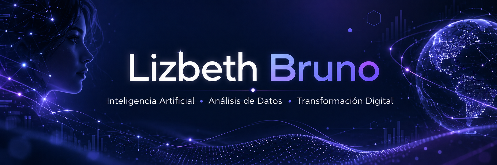

  

<h2 align="center">¡Hola! Soy Lizbeth 👋</h2>

  Inteligencia Artificial | Análisis de Datos | Transformación Digital

---

## 👩‍💻 Sobre mí

Soy profesional en Administración de Empresas y estudiante de la Maestría en Inteligencia Artificial, con experiencia en el sector financiero, análisis de datos, automatización y mejora continua.

Me apasiona identificar oportunidades de transformación, diseñar soluciones tecnológicas y conectar las necesidades del negocio con herramientas de análisis e inteligencia artificial.

Mi experiencia incluye el desarrollo de soluciones de principio a fin, procesamiento de grandes volúmenes de información, automatización de controles y optimización de procesos.

Creo en el aprendizaje continuo, la colaboración y en una tecnología que no solo sea innovadora, sino que genere resultados medibles y valor para las personas y las organizaciones.

---

## 🛠️ Tecnologías y herramientas

  

**Análisis y procesamiento de datos:** SQL, Pandas, PySpark.

**Inteligencia Artificial:** Machine Learning, Deep Learning y Procesamiento de Lenguaje Natural.

**Entornos de desarrollo:** Jupyter Notebook, Google Colab y AWS SageMaker.
